Este programa foi criado inteiramente em linguagem Java e apresenta conexão ao banco de dados com MySQL, utilizando os conceitos de CRUD (_Create, Read, Update e Delete_ - Criar, Ler, Atualizar e Excluir), arquitetura MVC (_Model, View, Controller_ - Modelo, Visão e Controlador) e interface gráfica utilizando Java Swing. Foi criado um gerenciamento de jogos para aplicação de conceitos relacionados aos tópicos citados.

Ao utilizar o programa, a primeira tela apresentada ao usuário é a tela de Menu, onde ele pode selecionar uma das opções presentes nos botões da tela. Ao selecionar a opção desejada, ele será redirecionado para a tela correspondente à ação.  

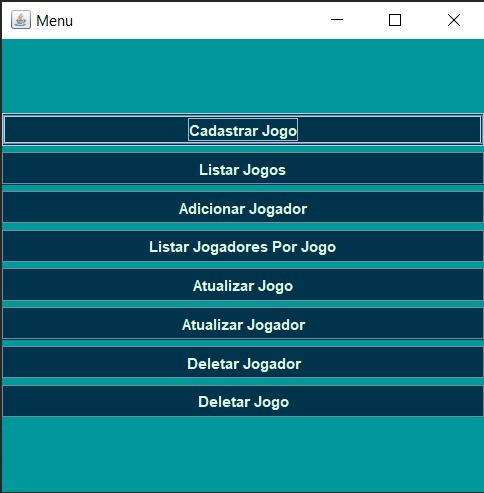

## **1- Adicionar Jogo**
Nesta tela, o usuário é capaz de adicionar um jogo ao banco de dados. Para tal, basta preencher corretamente as lacunas de nome e categoria e selecionar um valor para a nota com a qual ele avaliará o jogo. Após preenchido, basta que clique no botão salvar para que as informações sejam devidamente salvas. Caso haja algo errado com o preenchimento de dados, o usuário receberá alertas sobre as falhas correspondentes, pois todos os campos são validados. Caso deseje voltar ao menu, basta selecionar o botão voltar.

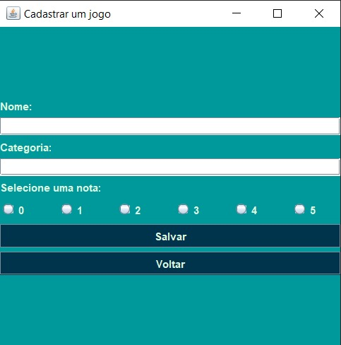

## **2- Listar Jogos**
Ao selecionar a opção de listar os jogos, o usuário será redirecionado para uma tela onde todos os jogos cadastrados no banco de dados estão listados em um formato de tabela, apresentando todos os dados como foram preenchidos previamente. Para sair desta tela, basta selecionar o botão voltar.

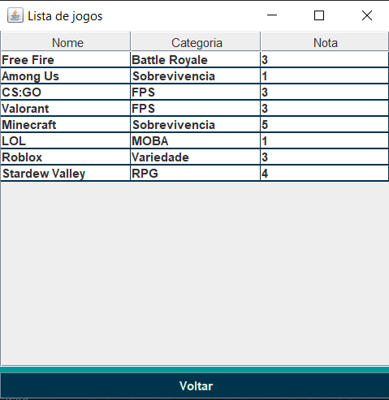

## **3- Adicionar Jogador**
Nesta opção, o usuário deve preencher os dados referentes ao jogador que será adicionado, como o nome de usuário, quantidade de vitórias e quantidade de derrotas, além de escolher em um combo box o jogo ao qual este usuário pertence. Ao preencher tudo corretamente, basta que utilize o botão salvar para que os dados sejam salvos no banco de dados. Caso haja algum problema com o preenchimento dos dados, o usuário será alertado, pois todos os campos apresentam validação. Para sair desta tela, basta selecionar o botão voltar.

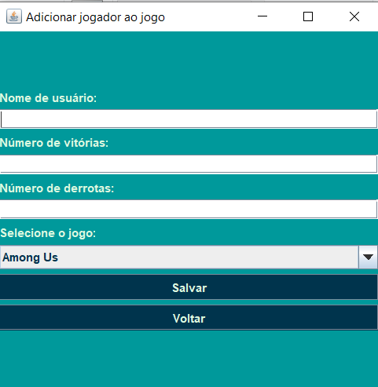

## **4- Listar Jogadores Por Jogo**
Selecionando esta opção, o usuário deve passar por uma tela de busca onde ele selecionará o jogo do qual gostaria de ver os jogadores. Após esta escolha, será redirecionado para uma tela onde os jogadores adicionados previamente ao jogo selecionado estão listados em forma de tabela com os dados cadastrados, além de um dado extra: o elo. Este dado é calculado automaticamente pelo programa utilizando os valores de vitórias e derrotas preenchidos ao adicionar o jogador. E, nas duas telas citadas, o usuário pode utilizar o botão de voltar para retornar ao menu.

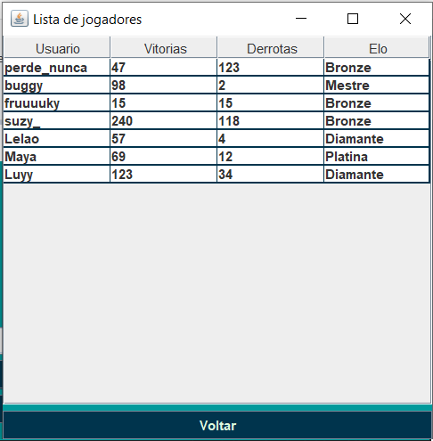

## **5- Atualizar Jogo**
Ao escolher esta opção, o usuário terá novamente uma tela de busca onde deve selecionar o jogo que deseja atualizar os dados. Após a escolha, ele será redirecionado à tela já citada de adicionar jogo, mas com um diferencial: desta vez, os dados pré-cadastrados estarão preenchendo as opções para que sejam atualizados de acordo com a necessidade. Ao clicar em salvar, os dados são atualizados no banco de dados e podem ser conferidos na tela de listar jogos. Para sair, basta clicar em voltar.

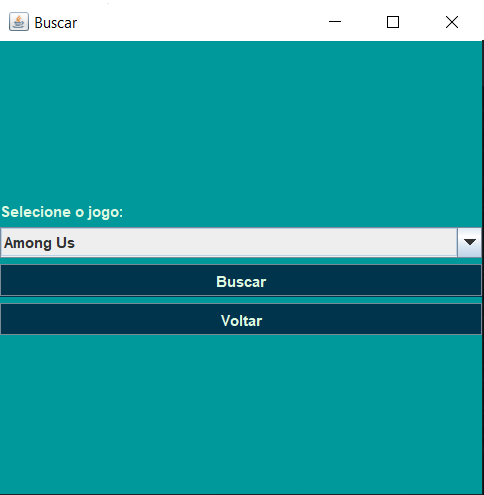

## **6- Atualizar Jogador**
Esta é uma opção bem semelhante à anterior. Aqui, o usuário deve procurar por um jogador que será atualizado. Ao abrir a tela de adicionar jogador, os dados estarão pré-preenchidos e podem ser atualizados, exceto o jogo. Este dado não pode ser alterado; ele é exibido, mas a edição é desabilitada. Se desejar sair, basta utilizar o botão de voltar.

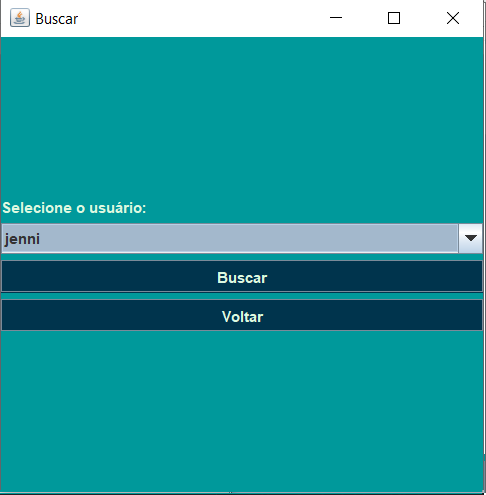

## **7- Deletar Jogador**
Nesta tela, o usuário terá de escolher qual jogador será selecionado para ser deletado do banco de dados e, consequentemente, do programa. Ao selecionar o jogador e clicar no botão excluir, o usuário receberá um alerta de confirmação e deve selecionar a opção "sim" para que a ação seja concluída. Caso contrário, nada acontece. Para desistir da ação, basta usar o botão voltar.

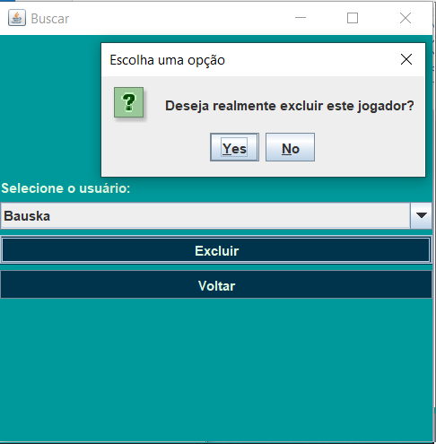

## **8- Deletar Jogo**
Aqui, o usuário poderá selecionar o jogo de sua preferência para deletar para sempre, ou pelo menos até ser adicionado novamente. Ao selecionar o jogo que deseja excluir, o usuário receberá um alerta de confirmação que pergunta se ele quer mesmo excluir aquele jogo e todos os jogadores adicionados nele. Ao selecionar "sim", o jogo será excluído e todos os jogadores vinculados a ele também. Caso a resposta seja "não", nada acontece. Para voltar, basta utilizar o botão voltar.

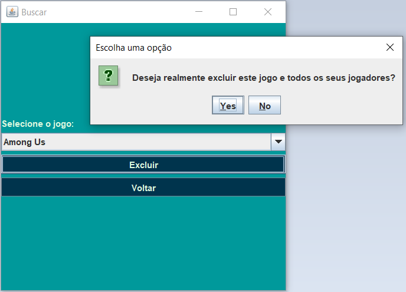

Como citado anteriormente, este programa tem seu banco de dados feito com o MySQL, para isso foi feito um [script](./SQLJogo.sql) e um DER (Diagrama de Entidade e Relacionamento) para organizar o banco de dados e conseguir armazenar corretamente todos os dados necessários. 

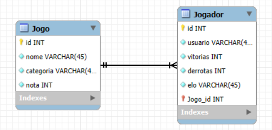

Por fim, mas não menos importante, também foi feito um Diagrama de Classes expressando visualmente as classes com seus atributos e métodos presentes neste programa.

**Azul claro** - Model  
**Roxo** - Controller  
**Rosa** - View  

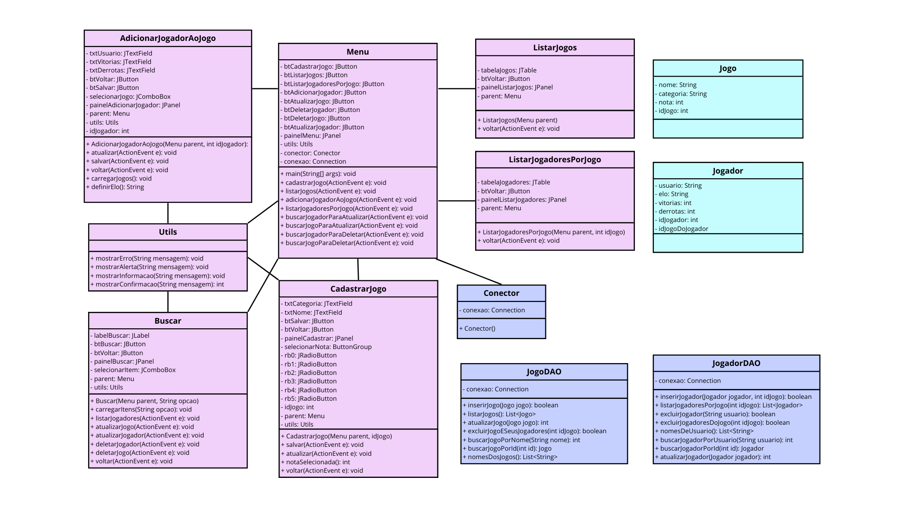
